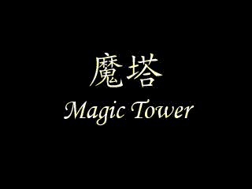
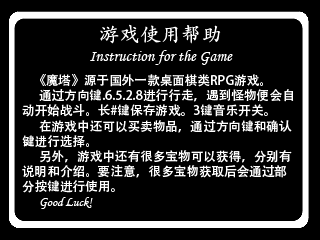
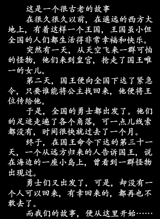
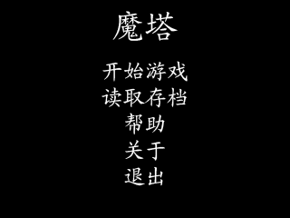

# MagicTower
展讯Mocor平台 魔塔游戏
 

## Requirements
项目基于展讯**Mocor**平台**SC6800H_SP6801H**硬件及软件版本. 适用于**240*320**分辨率.

## 预览

## idea
将高中时在步步高电子词典上玩的黑白魔塔游戏, 在手机上实现.

## 项目思路

### 1. 游戏引擎

   通过一个硬定时器, 以及多个软件定时器驱动游戏. 受限于20M的CPU. 游戏帧数只有5帧.

### 2. 事件分发

   通过场景控制. 控制键盘事件的分发. 类似于cocoas2d的CCScene
